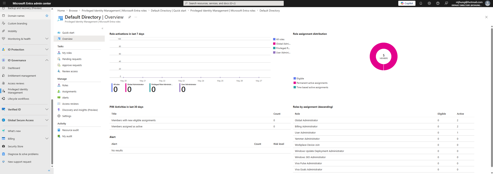
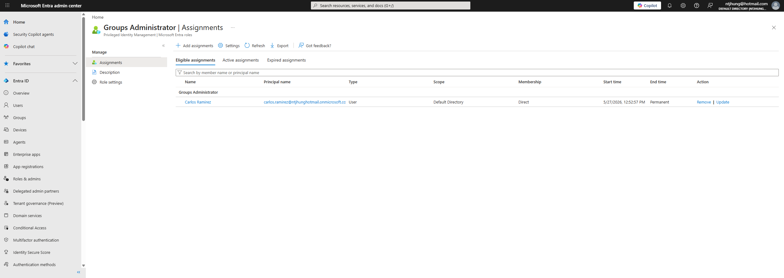
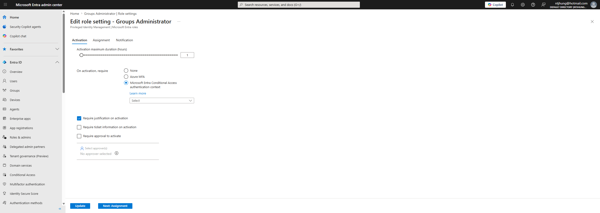
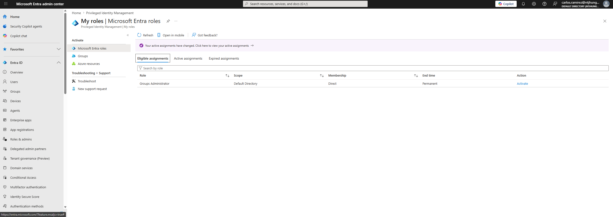
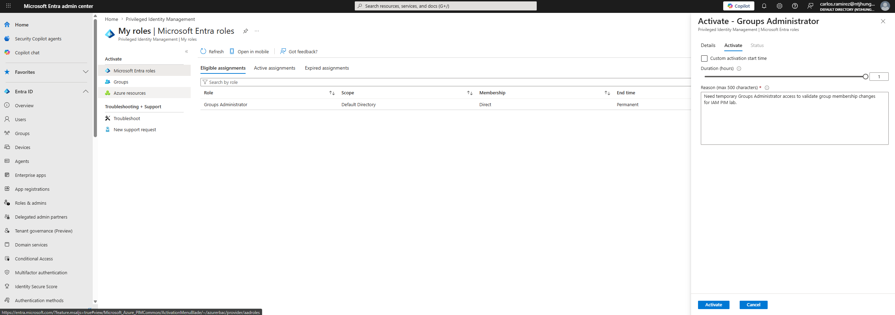
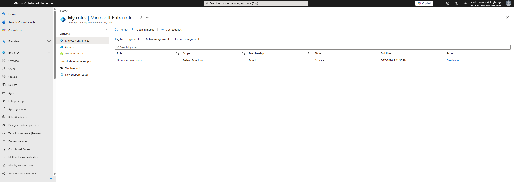
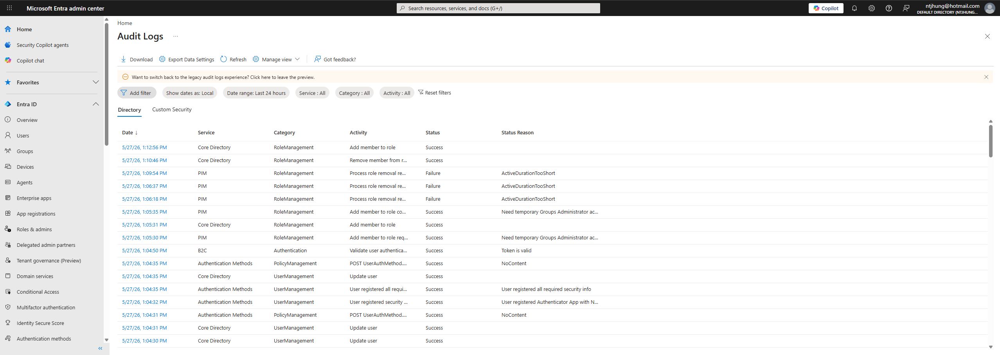

# Entra PIM Privileged Access Lab

## Project Overview

This project demonstrates Microsoft Entra Privileged Identity Management for privileged access control. The lab focuses on reducing standing administrator access by using eligible role assignments, just-in-time activation, justification, time-limited access, break-glass planning, and audit evidence.

The purpose of this project is to show how privileged roles can be managed more securely using Microsoft Entra ID P2 and Privileged Identity Management.

## Business Problem

Organizations need to reduce the risk of excessive or unnecessary administrator access. Permanent admin access can create security risk if an account is compromised or misused. Privileged Identity Management helps reduce standing access by allowing users to activate privileged roles only when needed.

## Tools Used

- Microsoft Entra ID
- Microsoft Entra ID P2 Trial
- Privileged Identity Management
- Microsoft Entra roles
- Eligible role assignments
- Just-in-time activation
- Role activation justification
- Time-limited privileged access
- Break-glass account planning
- PIM audit history
- GitHub documentation
- Screenshots as audit evidence

## What This Project Demonstrates

- Privileged Identity Management concepts
- Eligible vs active role assignments
- Just-in-time privileged access
- Time-limited administrator access
- Role activation with justification
- Privileged access documentation
- Break-glass account planning
- PIM audit evidence collection
- IAM security documentation

## Lab Roles

The lab focuses on safer privileged access using lower-risk administrator roles instead of assigning permanent Global Administrator access.

Roles used or documented:

- Groups Administrator
- User Administrator
- Authentication Administrator

## Lab Accounts

### Admin / Owner Account

Used to configure PIM settings and assign eligible roles.

### PIM Test User

Used to demonstrate eligible role assignment and role activation.

### Break-Glass Account

Emergency account documented for tenant recovery planning. This account should not be used for daily administration.

## Project Files

- docs/
- screenshots/

## Documentation Created

- docs/PIM-Role-Assignment-Plan.md
- docs/PIM-Activation-Workflow.md
- docs/Break-Glass-Plan.md
- docs/PIM-Audit-Evidence.md

## Lab Screenshots

### PIM Overview

### Eligible Role Assignment

### Role Settings

### Role Activation

### Activation Justification

### Active Role After Activation

### PIM Audit History

## Key IAM Concepts Demonstrated

### Privileged Identity Management

Privileged Identity Management helps manage, control, and monitor access to important resources.

### Eligible Access

Eligible access means a user has permission to activate a role when needed, but the role is not active all the time.

### Just-in-Time Access

Just-in-time access allows privileged access to be activated only for a limited period.

### Justification

Justification requires the user to document why privileged access is needed before activating the role.

### Least Privilege

Least privilege means users should only have the access needed to complete their job responsibilities.

### Break-Glass Planning

Break-glass accounts provide emergency access if normal administrator access is unavailable.

### Audit Evidence

PIM audit history helps show role assignments, activations, and privileged access activity.

## Testing Approach

The lab followed this basic process:

1. Opened Microsoft Entra Privileged Identity Management.
2. Selected a safer administrator role for testing.
3. Assigned the role as eligible instead of permanently active.
4. Reviewed role settings.
5. Signed in as the PIM test user.
6. Activated the eligible role.
7. Entered a business justification.
8. Confirmed the role became active temporarily.
9. Captured audit evidence.

## Resume Bullet

- Built a Microsoft Entra PIM privileged access lab using eligible role assignments, just-in-time activation, justification, time-limited access, break-glass planning, and audit evidence documentation.

## Status

Completed Microsoft Entra PIM privileged access lab with eligible role assignment, just-in-time activation, justification, time-limited access, break-glass planning, documentation, and audit evidence screenshots.
